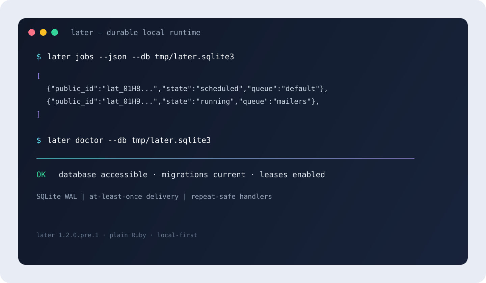

<p align="center">
  
</p>

<p align="center">
  <strong>Durable time and workflows for Ruby.</strong><br>
  A local-first temporal runtime for plain Ruby, backed by SQLite.
</p>

<p align="center">
  <a href="https://github.com/theworker02/later/actions/workflows/ci.yml"></a>
  <a href="https://github.com/theworker02/later/actions/workflows/pages.yml"></a>
  <a href="https://rubygems.org/gems/later">RubyGems package</a>
  <a href="LICENSE"></a>
  <a href="https://www.ruby-lang.org/en/"> </a>
</p>

> **Development release:** `1.2.0.pre.1` is a prerelease. The public API may change before a stable `1.2.0` release. The supported core is plain Ruby with local SQLite; PostgreSQL, Rails/Active Job, an authenticated dashboard, network transports, hosted documentation, full calendar/DST parsing, and OpenTelemetry exporters are not claimed as shipped features.

## Why later?

Applications often need more than a timer and less than a hosted orchestration platform. `later` keeps durable scheduling close to the application: jobs are persisted in SQLite, claimed through leases, recoverable after process failure, and inspectable from Ruby or the command line.

The same runtime can grow from a single delayed call into recurring work, durable events, futures, workflow graphs, and SQLite-backed streams without requiring a separate service or a framework adapter. The result is a small, explicit coordination layer that is easy to run locally and straightforward to test.

### At a glance

| Capability | What `later` provides |
| --- | --- |
| Storage | SQLite persistence with WAL mode, migrations, busy timeouts, leases, and recovery |
| Scheduling | Delayed jobs, intervals, weekday rules, timezone metadata, simulation, and virtual-clock helpers |
| Dispatch | Named constant/method calls, priorities, queues, tags, retries, timeouts, deadlines, and idempotency keys |
| Reliability | Heartbeats, lease expiry recovery, worker supervision, circuit breakers, rate limiting, and immutable history |
| Composition | Futures, durable events, filtered subscriptions, validated DAG workflows, and journal boundaries |
| Streams | Append-only SQLite streams with offsets, consumer groups, replay, rewind, retention, and schema validation |
| Operations | A portable `later` CLI for inspection, simulation, linting, diagnostics, and stream administration |

## Install

`later` targets Ruby **3.2 or newer** and requires a working `sqlite3` native extension for the host platform.

Install the released package from [RubyGems](https://rubygems.org/gems/later):

```sh
gem install later
```

Add it to a Bundler-managed application with:

```ruby
# Gemfile
gem "later"
```

Then install dependencies:

```sh
bundle install
```

For a checkout, use the repository setup helper:

```sh
bin/setup
```

## Five-minute start

Configure a local database, schedule work, and run the embedded worker:

```ruby
require "later"

Later.configure(path: "tmp/later.sqlite3")

Later.in("10m") { Cleanup.run }
Later.every("weekday at 09:00", timezone: "UTC") { Digest.send }
```

Start a worker from the same environment:

```sh
later run --db tmp/later.sqlite3
```

For restart-safe dispatch, use a named constant and JSON-compatible arguments rather than capturing an anonymous closure as durable state:

```ruby
class Reports
  def self.generate_monthly(month:)
    # Build the report for the supplied month.
  end
end

Later.configure(path: "tmp/later.sqlite3")
Later.call(Reports, :generate_monthly, at: "2026-09-01 09:00", month: "2026-08")
```

Jobs are persisted before dispatch. A worker crash or expired lease makes eligible work available for recovery, but external effects still follow an **at-least-once** model. Make handlers repeat-safe and use idempotency keys around external APIs.

## Scheduling and recurrence

Intervals and weekday schedules are represented as explicit recurrence rules rather than only retaining the original input string:

```ruby
Later.configure(path: "tmp/later.sqlite3")

Later.in("30s") { Cache.refresh }
Later.every("15m") { Metrics.flush }
Later.every("weekday at 09:00", timezone: "America/New_York") do
  Digest.send
end
```

Use the simulator before deploying a rule:

```sh
later simulate "weekday at 09:00" --next 10 --timezone UTC
```

For IANA timezone conversion, load `tzinfo` in the application. Without it, the runtime uses the host local timezone and does not claim complete daylight-saving ambiguity handling. See [`docs/scheduling/timezones.md`](docs/scheduling/timezones.md).

## Workflows and events

Workflow definitions are validated as directed acyclic graphs before steps are scheduled:

```ruby
Later.workflow(:release) do
  step(:test) { TestSuite.run }
  step(:build, after: :test) { Build.run }
  step(:publish, after: :build) { Publish.run }
end

Later.start_workflow(:release)
```

Events are persisted before local subscribers run, and filters can keep subscribers focused:

```ruby
Later.on("invoice.paid", where: ->(event) { event[:total].to_f > 1_000 }) do |event|
  FraudReview.run(event)
end

Later.emit("invoice.paid", invoice_id: 42, total: 2_000)
```

Use the event and workflow boundaries when you need durable local coordination, but do not treat them as a distributed transaction. Network delivery, hosted workers, and external transports are outside the core package.

## Durable streams

`Later::Stream` is a prerelease SQLite-backed append-only event log. Each event has a stable stream offset, JSON payload, metadata, timestamp, correlation and causation IDs, and producer identity.

```ruby
require "later"

orders = Later::Stream.open("orders")
orders.publish(type: "order.created", data: { order_id: 842 })

consumer = orders["analytics"]
while (event = consumer.next)
  Analytics.apply(event)
  consumer.ack(event)
end
```

Consumer groups have independent committed offsets. Unacknowledged events become available after lease expiry and may be redelivered. Streams support replay, rewind, lag inspection, delayed visibility, retention, wildcard subscriptions, and JSON schema validation.

```ruby
orders.rewind("analytics", to: 0)
orders.lag("analytics")
orders.replay(from: 100) { |event| puts event.type }
```

Delivery is at-least-once. Consumers must be idempotent. See [`docs/streams.md`](docs/streams.md) and [`docs/streams-cli.md`](docs/streams-cli.md).

## Command-line interface

The gem installs the `later` executable. Use `--db PATH` to point commands at an explicit SQLite database, or configure the database through `LATER_DB`.

```sh
# Inspect jobs as JSON.
later jobs --json --db tmp/later.sqlite3

# Inspect one job and its event timeline.
later inspect lat_... --db tmp/later.sqlite3

# Review execution history and exhausted jobs.
later history --db tmp/later.sqlite3
later dead --db tmp/later.sqlite3

# Retry or cancel a job.
later retry lat_... --db tmp/later.sqlite3
later cancel lat_... --db tmp/later.sqlite3

# Validate and explore recurrence rules.
later lint "15m"
later simulate "weekday at 09:00" --next 10 --timezone UTC

# Check runtime and database health.
later doctor --db tmp/later.sqlite3
later db check --db tmp/later.sqlite3
```

Stream administration is available through the same command:

```sh
later stream create orders --db tmp/later.sqlite3
later stream publish orders --type order.created --data '{"order_id":842}' --db tmp/later.sqlite3
later stream history orders --db tmp/later.sqlite3
later stream replay orders --from 10 --db tmp/later.sqlite3
later stream consume orders --group analytics --db tmp/later.sqlite3
later stream lag orders --group analytics --db tmp/later.sqlite3
later stream compact orders --db tmp/later.sqlite3
```

## Visual tour

The release includes the CLI in the Ruby gem and attaches that `.gem` to GitHub Releases. The package contains the `later` executable, runtime library, license, README, and lightweight brand/media assets.

<p align="center">
  
</p>

<p align="center">
  <a href="assets/media/later-cli-demo.svg">Open the animated CLI demo</a>
</p>

The demo is an original animated SVG rather than a hosted GIF or video. That keeps the README, RubyGems package, and documentation site portable, sharp at any resolution, and free from third-party media dependencies.

## Reliability and security model

`later` is designed for durable local coordination, not for promising impossible exactly-once external effects.

- **At-least-once delivery:** a job or stream event can be retried or redelivered after a failure or expired lease.
- **Repeat-safe handlers:** use idempotency keys and make external side effects safe to repeat.
- **Durable state:** jobs, event payloads, leases, stream offsets, and execution history are persisted in SQLite.
- **Trusted application boundary:** job handlers are application code; the SQLite database and any unauthenticated control surface must not be exposed to untrusted users.
- **Restricted arguments:** durable callable arguments are limited to JSON-compatible strings, numbers, booleans, arrays, hashes, and null. Procs, open files, arbitrary Ruby objects, and arbitrary deserialization are rejected.

Read [`ARCHITECTURE.md`](ARCHITECTURE.md), [`SECURITY.md`](SECURITY.md), and [`docs/security/serialization.md`](docs/security/serialization.md) before using the runtime around sensitive data or external side effects.

## Support boundary

The current development line is intentionally local-first:

| Area | Status |
| --- | --- |
| Plain Ruby runtime | Supported by the core package |
| Local SQLite persistence | Supported and tested on the CI-supported Ruby matrix |
| Ruby | `>= 3.2` |
| PostgreSQL coordination | Roadmap / extension work |
| Rails or Active Job integration | Roadmap / extension work |
| Authenticated dashboard | Roadmap / extension work |
| Network worker transports | Roadmap / extension work |
| Full calendar and DST-aware recurrence parsing | Roadmap / extension work |
| OpenTelemetry exporters | Roadmap / extension work |

Roadmap items are not shipped features. Each integration requires its own implementation, tests, documentation, and clean-environment validation. See [`COMPATIBILITY.md`](COMPATIBILITY.md) and [`ROADMAP.md`](ROADMAP.md).

## Package and project layout

The Ruby gem keeps the runtime package deliberately focused:

```text
lib/                 Runtime, persistence, scheduling, events, streams, workflows
exe/later             Installed end-user CLI
assets/brand/         Original mark and wordmark included with the gem
assets/media/         Lightweight CLI screenshot and animated demo
LICENSE               MIT license
README.md             Package and project overview
```

The repository also contains:

- `test/` — unit and integration behavior;
- `examples/` — runnable, application-shaped examples;
- `docs/` — focused scheduling, stream, CLI, migration, and security documentation;
- `website/` — Astro documentation site using the same visual identity;
- `.github/` — CI, security, dependency, Pages, and release automation.

## Development

Clone the repository and install the locked development dependencies:

```sh
git clone https://github.com/theworker02/later.git
cd later
bin/setup
```

Run the test suite and packaging checks:

```sh
bundle exec rake test
gem build later.gemspec
ruby scripts/verify_gem later-*.gem
```

The package verifier confirms that the gem contains the executable and runtime entrypoint and rejects database files. The full test suite requires a working `sqlite3` native extension for the current Ruby and operating system.

For documentation work:

```sh
cd website
npm install
npm run check
npm run build
```

Before opening a change, read [`CONTRIBUTING.md`](CONTRIBUTING.md), [`SUPPORT.md`](SUPPORT.md), and [`RELEASE.md`](RELEASE.md). Security issues should follow [`SECURITY.md`](SECURITY.md) rather than being filed publicly.

## Releases

Tagged releases use the GitHub Actions workflow in [`.github/workflows/release.yml`](.github/workflows/release.yml). The workflow runs validation, builds and verifies the gem, creates or updates the matching GitHub Release with the `.gem` attached, and publishes through RubyGems Trusted Publishing. No long-lived RubyGems API key is stored in the repository.

The current `1.2.0.pre.1` line is a development release. Consult [`RELEASE.md`](RELEASE.md) for the release checklist and [`RELEASE_NOTES_v1.2.0.pre.1.md`](RELEASE_NOTES_v1.2.0.pre.1.md) for its scope and limitations.

## Contributing

Contributions are welcome when they preserve the project’s explicit boundaries: plain Ruby and local SQLite in the core package, at-least-once delivery semantics, repeat-safe external effects, and no claims for integrations that are not implemented and tested.

Good contributions usually include focused tests, documentation for public behavior, and a clear note about compatibility or migration impact. Keep changes small enough to review and avoid adding hosted-service assumptions to the core runtime.

## License

`later` is released under the MIT License. See [`LICENSE`](LICENSE).
